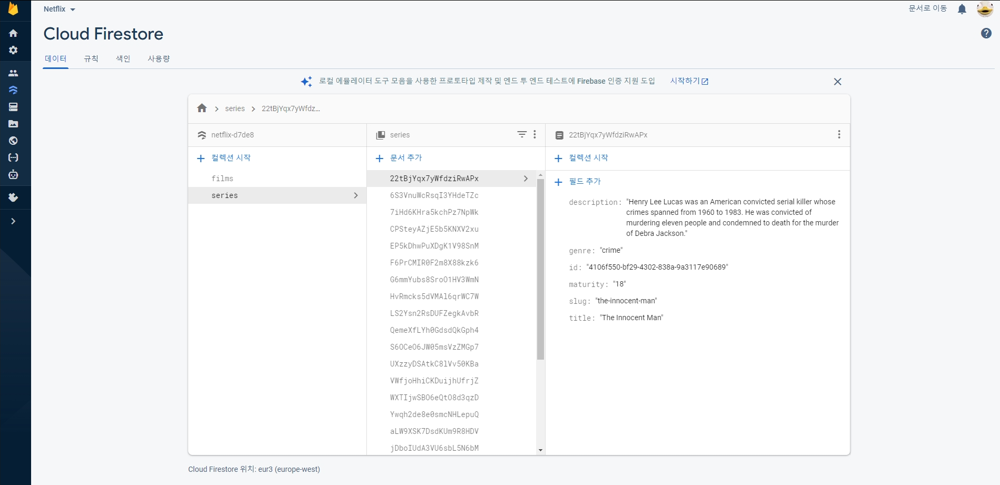
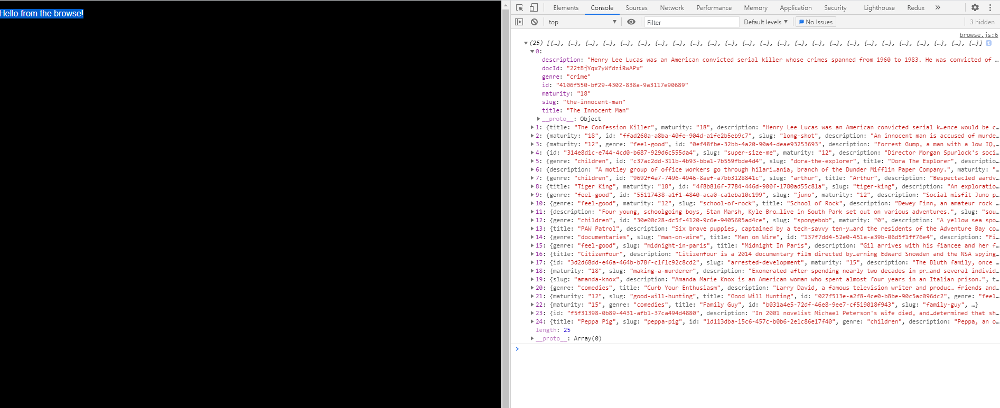

## Netflix 클론 사이트 만들기(ver.2021/05/29)

</img>
</img>

* 오늘은 로그인 성공 후 보여지게되는 browse.js 페이지를 구성할 컨텐츠들을 firebase로부터 데이터를 받아오는 작업을 했습니다.
* browse.js페이지에는 각 시리즈별로 컨텐츠들을 구성할 예정 입니다.

[src/hooks/use-content.js]
```javascript
import { useEffect, useState, useContext } from 'react';
import { FirebaseContext } from '../context/firebase';

// target은 browse.js페이지에서 이 함수를 firebase의 store에 저장된 컬렉션 films 또는 series를 인자로 지정하면 선택된 컬렉션내부의 데이터를 가져오게됩니다.
export default function useContent(target) {
    const [content, setContent] = useState([]);
    const { firebase } = useContext(FirebaseContext);

    useEffect(() => {
        firebase
            // firebase의 firestore로 접근
            .firestore()
            // 컬렉션중 target이된 컬렉션으로 접근
            .collection(target)
            // 가져옵니다.
            .get()
            // then() 내부에는 실제 취하게될 명령
            // map을 이용하여 선택된 컬렉션의 데이터를 가져오고 추가로 docId를 각 컨텐츠별로 부여 합니다.
            .then((snapshot) => {
                const allContent = snapshot.docs.map((contentObj) => ({
                    ...contentObj.data(),
                    docId: contentObj.id
                }))
                // 그리고 만들어두었던 content state의 값을 가져온 데이터로 변경 합니다.
                setContent(allContent);
            })
            // 에러가 있을경우 콘솔로그로 표시 합니다.
            .catch((error) => {
                console.log(error.message);
            })
    }, [])
    // 마지막으로 firestore에있는 컬렉션중 선택된 target과 그것의 content를 return 해줍니다.
    return { [target]: content }
}
```

[src/pages/browse.js]
```javascript
import React from 'react';
// 실제로 browse.js 페이지에서 데이터가 잘 넘어왔는지 확인하기위해 import 했습니다.
import useContent from '../hooks/use-content';

export default function Browse() {
    const { series } = useContent('series');
    console.log(series);

    return <p>Hello from the browse!</p>;
}
```