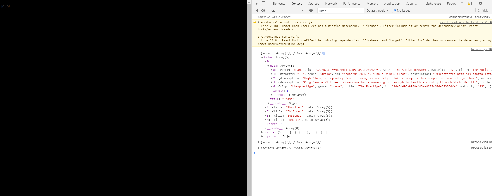

## Netflix 클론 사이트 만들기(ver.2021/05/30)

</img>

* 오늘은 firestore에서 가져온 컨텐츠들의 데이터들을 각 컬렉션과 장르에 해당하는부분만 필터링해서 나타낼수있는 함수를 만들었습니다.

[src/utils/selection-filter.js]
```javascript
// 컬렉션(series, films) 별로 배열로 각 컨텐츠들을 담았습니다.
// filter를 통해서 해당 컬렉션의 장르별로 데이터를 가져올수 있도록 했습니다.
export default function selectionFilter({ series, films }) {
    return {
        series: [
            {
                title: 'Documentaries',
                data: series.filter((item) => item.genre === 'documentaries'),
            },
            {
                title: 'Comedies',
                data: series.filter((item) => item.genre === 'comedies'),
            },
            {
                title: 'Children',
                data: series.filter((item) => item.genre === 'children'),
            },
            {
                title: 'Crime',
                data: series.filter((item) => item.genre === 'crime'),
            },
            {
                title: 'Feel Good',
                data: series.filter((item) => item.genre === 'feel-good'),
            }
        ],
        films: [
            {
                title: 'Drama',
                data: films.filter((item) => item.genre === 'drama'),
            },
            {
                title: 'Thriller',
                data: films.filter((item) => item.genre === 'thriller'),
            },
            {
                title: 'Children',
                data: films.filter((item) => item.genre === 'children'),
            },
            {
                title: 'Suspense',
                data: films.filter((item) => item.genre === 'suspense'),
            },
            {
                title: 'Romance',
                data: films.filter((item) => item.genre === 'romance'),
            }
        ]
    }
}
```

[src/containers/browse.js]
```javascript
// 이곳은 앞으로 로그인후 실제로 컨텐츠들이 컬렉션 및 장르별로 슬라이드식으로 표현될수 있는 공간 입니다.
import React from 'react';

export function BrowseContainer({ slides }) {
    return <p>Hello!</p>
}
```

[src/pages/browse.js]
```javascript
// 여기까지 firestore에서 컨텐츠들의 데이터를 가져오고 장르별로 필터링기능의 함수도 만들고 실제 browse화면을 그려줄 컨테이너를만들어 적용 시켰습니다.
import React from 'react';
import useContent from '../hooks/use-content';
import selectionFilter from '../utils/selection-filter';
import { BrowseContainer } from '../containers/browse';

export default function Browse() {
    const { series } = useContent('series');
    const { films } = useContent('films');
    const slides = selectionFilter({ series, films });
    console.log(slides);

    return <BrowseContainer slides={slides} />;
}
```