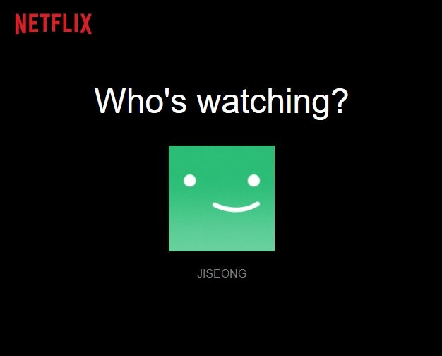
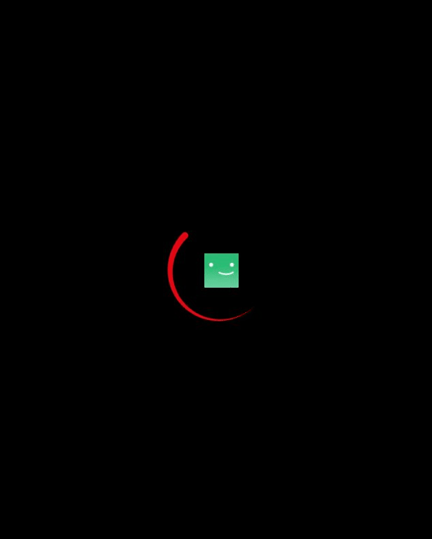

## Netflix 클론 사이트 만들기(ver.2021/06/01)

</img>
</img>

* 오늘은 browse 페이지에서 어떤 사용계정으로 선택하는 영역에서 사용자계정에 css를 적용해주었습니다.
* 원하는 사용자계정을 클릭하면 css 애니메이션을 이용한 로딩효과가 나오게 했습니다.

[src/containers/browse.js]
```javascript
import React, { useState, useContext, useEffect } from 'react';
import { SelectProfileContainer } from './profiles';
import { FirebaseContext } from '../context/firebase';
import Loading from '../components/loading/index';

export function BrowseContainer({ slides }) {
    const [profile, setProfile] = useState({});
    const [loading, setLoading] = useState(true);
    const { firebase } = useContext(FirebaseContext);
    const user = firebase.auth().currentUser || {};

    useEffect(() => {
        console.log('profile', profile)
        // 3초후 Loading의 값을 false로 바꿔지도록 설정 했습니다.
        setTimeout(() => {
            setLoading(false);
        }, 3000);
    }, [profile.displayName]); // profiles 컨테이너에서 프로필을 클릭하면 setProfile props를 통해 user 정보(displayName, photoURL)가 전달되면서 해당 useEffect가 실행 됩니다.

    // profile의 state값중 displayName값이 있으면 true일때 loading을 호출하고 없을경우 일반적인 유저선택화면을 보여주게 됩니다.
    // loading의 초기값은 true일때 Loading 컴포넌트가 실행되는데 앞서 상단 useEffect에서 3초후 loading값이 false로 바뀌면서 null값으로 바뀌게 됩니다.
    return profile.displayName ? (
        loading ? (
            <Loading src={user.photoURL} />
        ) : null
    ) : (
        <SelectProfileContainer user={user} setProfile={setProfile}/>
    )
}
```

[src/containers/profiles.js]
```javascript
import React from 'react';
import Header from '../components/header/index';
import Profiles from '../components/profiles/index';
import * as ROUTES from '../constants/routes';
import logo from '../logo.svg';

export function SelectProfileContainer({ user, setProfile }) {
    return (
        <>
            <Header bg={false}>
                <Header.Frame>
                    <Header.Logo to={ROUTES.HOME} src={logo} alt="Netflix" />
                </Header.Frame>
            </Header>

            <Profiles>
                <Profiles.Title>Who's watching?</Profiles.Title>
                <Profiles.List>
                    {/* li의 역할을하는 컴포넌트(각 사용자 계정을 나타냄)를 클릭하게되면 setProfile 프롭스를 통해 user정보를 상위 컴포넌트인 browse 컨테이너에 전달 합니다. */}
                    <Profiles.User 
                        onClick={() => 
                            setProfile({
                                displayName: user.displayName,
                                photoURL: user.photoURL
                            })
                        }
                    >
                        <Profiles.Picture src={user.photoURL} />
                        <Profiles.Name>{user.displayName}</Profiles.Name>
                    </Profiles.User>
                </Profiles.List>
            </Profiles>
        </>
    )
}
```

[src/components/profiles/styles/profiles.js]
```javascript
// 이부분은 각 사용자 계정의 css를 적용하는 곳 입니다.
import styled from 'styled-components/macro';

export const Container = styled.div`
    display: flex;
    flex-direction: column;
    justify-content: center;
    align-items: center;
    margin: auto;
    max-width: 80%;
`;

export const Title = styled.h1`
    width: 100%;
    color: #fff;
    font-size: 48px;
    text-align: center;
    font-weight: 500;
`;

export const List = styled.ul`
    margin: 0;
    padding: 0;
    display: flex;
    flex-direction: row;
`;

export const Name = styled.p`
    color: #808080;
    text-overflow: ellipsis;
    font-size: 16px;

    &:hover {
        font-weight: bold;
        color: #e5e5e5;
    }
`;

export const Picture = styled.img`
    width: 100%;
    max-width: 150px;
    height: auto;
    border: 3px solid #000;
    cursor: pointer;
`;

export const Item = styled.li`
    max-height: 200px;
    max-width: 200px;
    list-style-type: none;
    text-align: center;
    margin-right: 30px;

    &:hover ${Picture} {
        border: 3px solid #fff;
    }

    &:hover ${Name} {
        font-weight: bold;
        color: #fff;
    }

    &:last-of-type {
        margin-right: 0;
    }
`;
```

[src/components/loading/index.js]
```javascript
// 사용자계정을 클릭했을때 Loading 화면을 그려줄 컴포넌트 입니다.
import React from 'react';
import { Spinner, LockBody, ReleaseBody, Picture } from './styles/loading';

export default function Loading({ src, ...restProps }) {
    return (
        <Spinner>
            <LockBody />
            <Picture src={`/images/users/${src}.png`} />
        </Spinner>
    )
}

Loading.ReleaseBody = function LoadingReleaseBody() {
    return <ReleaseBody />
}
```

[src/components/loading/styles/loading.js]
```javascript
// 로딩화면을 그려줄 스타일 컴포넌트가 모여있는 곳 입니다.
import styled, { createGlobalStyle } from 'styled-components/macro';

export const LockBody = createGlobalStyle`
    body {
        overflow: hidden;
    }
`;

export const ReleaseBody = createGlobalStyle`
    body {
        overflow: visible;
    }
`;

// Spinner 스타일컴포넌트에 after로 가상영역을 주고 position으로 위치와 크기를 잡고 배경이미지를 준뒤 @keyframes을 사용하여 마치 360도로 회전하게 보이도록 설정 해주었습니다.
export const Spinner = styled.div`
    position: fixed;
    width: 100%;
    height: 100%;
    background-color: #000;
    z-index: 999;

    :after {
        content: '';
        position: absolute;
        top: 50%;
        left: 50%;
        background-image: url(/images/misc/spinner.png);
        background-size: contain;
        background-repeat: no-repeat;
        margin-top: -150px;
        margin-left: -75px;
        width: 150px;
        height: 150px;
        animation-name: spin;
        animation-duration: 1000ms;
        animation-iteration-count: infinite;
        animation-timing-function: linear;
    }

    @keyframes spin {
        from {
            transform: rotate(0deg);
        }
        to {
            transform: rotate(360deg);
        }
    }
`;

// 프로필이미지도 Spinner 내부에 위치시키기위해 position을 이용하여 크기와 위치를 맞춰주었습니다.
export const Picture = styled.img`
    width: 50px;
    height: 50px;
    position: absolute;
    top: 50%;
    left: 50%;
    margin-top: -100px;
    margin-left: -22px;
`;
```