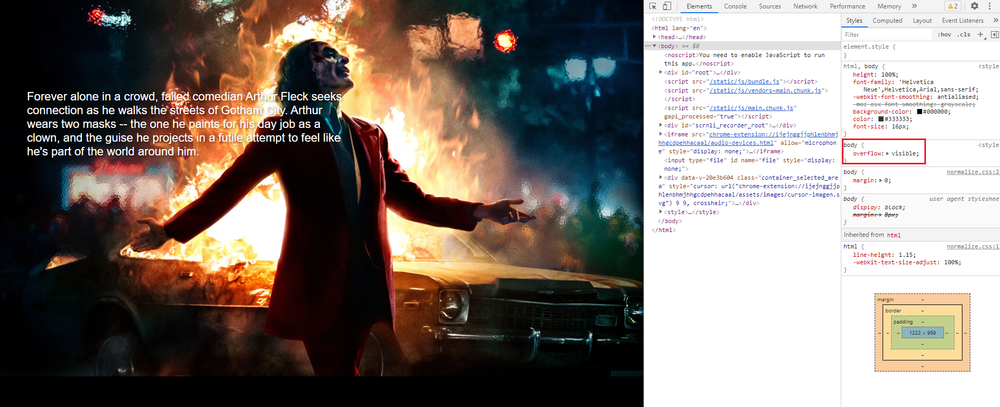

## Netflix 클론 사이트 만들기(ver.2021/06/02)

</img>

* 오늘은 접속할 사용자계정을 선택하면 로딩화면이 보였다가 실제 컨텐츠들을 볼 수 있는 화면으로 연결되도록 해주었습니다.

[src/containers/browse.js]
```javascript
import React, { useState, useContext, useEffect } from 'react';
import { SelectProfileContainer } from './profiles';
import { FirebaseContext } from '../context/firebase';
import Loading from '../components/loading/index';
import Header from '../components/header/index';

export function BrowseContainer({ slides }) {
    const [profile, setProfile] = useState({});
    const [loading, setLoading] = useState(true);
    const { firebase } = useContext(FirebaseContext);
    const user = firebase.auth().currentUser || {};

    useEffect(() => {
        console.log('profile', profile)
        setTimeout(() => {
            setLoading(false);
        }, 3000);
    }, [profile.displayName]);

    // 계정 로그인후 가장 먼저 보이는 화면은 <SelectProfileContainer user={user} setProfile={setProfile}/> 입니다.
    // 원하는 프로필을 선택하면 profile에 프로필정보가 입력되면서 true가되고 true안의 조건들이 실행이됩니다.
    // loading의 최초값이 true이기때문에 먼저 Loading 컴포넌트가 활성화되면서 로딩화면이 보여지고
    // 3초후 false로 바뀌면서 비로소 컨텐츠들을 볼수있는 화면인 <Loading.ReleaseBody /> 로 전개가 됩니다.
    return profile.displayName ? (
        <>
            {loading ? <Loading src={user.photoURL} /> : <Loading.ReleaseBody />}

            <Header src="joker1">
                <Header.Feature>
                    <Header.Text>
                        Forever alone in a crowd, failed comedian
                        Arthur Fleck seeks connection as he walks the streets of Gotham
                        City. Arthur wears two
                        masks -- the one he paints for his day job as a clown, and the
                        guise he projects in a futile attempt to feel like he's part of the
                        world around him.
                    </Header.Text>
                </Header.Feature>
            </Header>
        </>
    ) : (
        <SelectProfileContainer user={user} setProfile={setProfile}/>
    )
}
```

[src/components/loading/styles/loading.js]
```javascript
import styled, { createGlobalStyle } from 'styled-components/macro';

export const LockBody = createGlobalStyle`
    body {
        overflow: hidden;
    }
`;

export const ReleaseBody = createGlobalStyle`
    body {
        overflow: visible;
    }
`;
.
.
.
```

[src/components/header/index.js]
```javascript
import React from 'react';
import { Link as ReactRouterLink } from 'react-router-dom';
import { Background, ButtonLink, Container, Logo, Feature, Text } from './styles/header';

export default function Header({ bg=true, children, ...restProps }) {
    return bg ? <Background {...restProps}>{children}</Background> : children;
}

// 컨텐츠들이 보여지는 화면 Header영역에서 추가적으로 쓰일 컴포넌트들을 만들어 주었습니다.(HeaderFeature, HeaderText)
Header.Feature = function HeaderFeature({ children, ...restProps }) {
    return <Feature {...restProps}>{children}</Feature>;
}

Header.Text = function HeaderText({ children, ...restProps }) {
    return <Text {...restProps}>{children}</Text>;
}

Header.Frame = function HeaderFrame({ children, ...restProps }) {
    return <Container {...restProps}>{children}</Container>;
};

Header.ButtonLink = function HeaderButtonLink({ children, ...restProps }) {
    return <ButtonLink {...restProps}>{children}</ButtonLink>;
};

Header.Logo = function HeaderLogo({ to, ...restProps }) {
    return (
        <ReactRouterLink to={to}>
            <Logo {...restProps} />
        </ReactRouterLink>
    );
};
```

[src/components/header/styles/header.js]
```javascript
import styled from 'styled-components';
import { Link as ReactRouterLink } from 'react-router-dom';

export const Background = styled.div`
    display: flex;
    flex-direction: column;
    background: url(${({ src }) => src ? `../images/misc/${src}.jpg` : '../images/misc/home-bg.jpg'}) top left / cover no-repeat;
`;

export const Frame = styled.div``;

export const Container = styled.div`
    display: flex;
    margin: 0 56px;
    height: 64px;
    align-items: center;
    padding: 18px 0;
    justify-content: space-between;

    a {
        display: flex;
    }

    @media (max-width: 1000px) {
        margin: 0 30px;
    }
`;

export const Logo = styled.img`
    height: 32px;
    width: 108px;
    margin-right: 40px;

    @media (min-width: 1449px) {
        height: 45px;
        width: 167px;
    }
`;

export const ButtonLink = styled(ReactRouterLink)`
    display: block;
    background-color: #e50914;
    width: 84px;
    height: fit-content;
    color: white;
    border: 0;
    font-size: 15px;
    border-radius: 3px;
    padding: 8px 17px;
    cursor: pointer;
    text-decoration: none;
    box-sizing: border-box;

    &:hover {
        background-color: #f40612;
    }
`;

export const Feature = styled(Container)`
    padding: 150px 0 500px 0;
    flex-direction: column;
    align-items: normal;
    width: 50%;

    @media (max-width: 1100px) {
        display: none;
    }
`;

export const Text = styled.p`
    color: #fff;
    font-size: 22px;
    line-height: normal;
    text-shadow: 2px 2px 4px rgba(0, 0, 0, 0.45);
`;
```