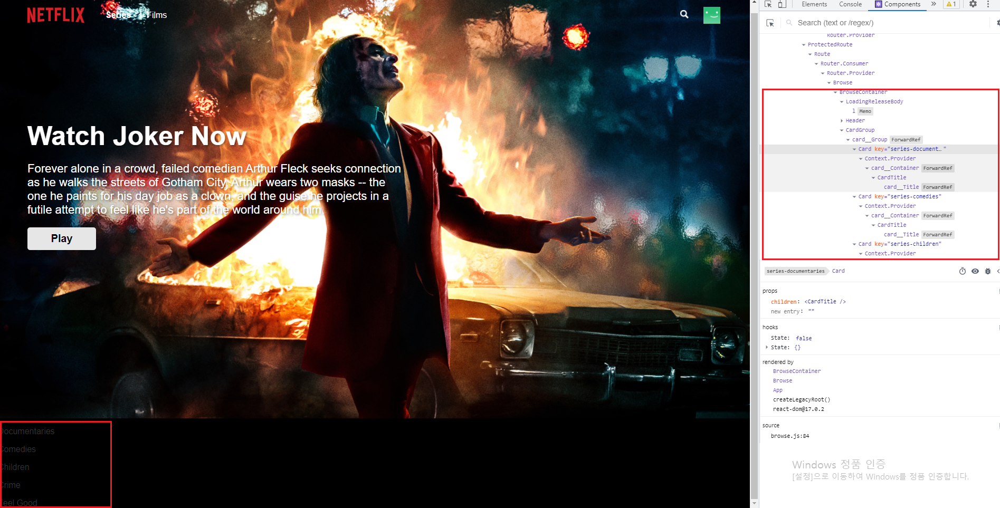

## Netflix 클론 사이트 만들기(ver.2021/06/09)

</img>

* 오늘은 browse페이지의 card영역에 firebase에저장한 series,films 컬렉션별로 데이터를 가져왔습니다.

[src/containers/browse.js]
```javascript
import React, { useState, useContext, useEffect } from 'react';
import { SelectProfileContainer } from './profiles';
import { FirebaseContext } from '../context/firebase';
import Loading from '../components/loading/index';
import Header from '../components/header/index';
import Card from '../components/card/index';
import * as ROUTES from '../constants/routes';
import logo from '../logo.svg';

export function BrowseContainer({ slides }) {
    // useState로 category와 slideRows를 새로 만들었습니다.
    // category의 값은 series 또는 films으로 설정 될것이고 slidesRows의 값은 빈배열안에 각 컬렉션별로 선택된 데이터들이 담겨질 공간 입니다.
    const [category, setCategory] = useState('series');
    const [searchTerm, setSearchTerm] = useState('');
    const [profile, setProfile] = useState({});
    const [loading, setLoading] = useState(true);
    const [slideRows, setSlideRows] = useState([]);

    const { firebase } = useContext(FirebaseContext);
    const user = firebase.auth().currentUser || {};

    useEffect(() => {
        console.log('profile', profile)
        setTimeout(() => {
            setLoading(false);
        }, 3000);
    }, [profile.displayName]);

    // slides는 앞서 pages의 browse.js에서만든변수이고 series와 films의 데이터값을 가지고 있습니다.
    // useEffect를통해 렌더링이 중복으로 되지않도록 설정해주었습니다.(값이 변경될때만 새로 렌더링됨)
    // category의 값은 화면상단에 series,films 링크를 클릭할때마다 변경되도록 아래에서 설정해줬습니다.
    useEffect(() => {
        setSlideRows(slides[category]);
    }, [slides, category]);

    return profile.displayName ? (
        <>
            {loading ? <Loading src={user.photoURL} /> : <Loading.ReleaseBody />}

            <Header src="joker1" dontShowOnSmallViewPort>
                <Header.Frame>
                    <Header.Group>
                        <Header.Logo to={ROUTES.HOME} alt="Netflix" src={logo} />
                        {/* Series링크를 클릭하면 category의 값은 series로 변경되고 active가 true가되면서 활성화됨 */}
                        <Header.TextLink
                            active={category === 'series' ? 'true' : 'false'}
                            onClick={() => setCategory('series')}
                        >
                            Series
                        </Header.TextLink>
                        <Header.TextLink
                            active={category === 'films' ? 'true' : 'false'}
                            onClick={() => setCategory('films')}
                        >
                            Films
                        </Header.TextLink>
                    </Header.Group>
                    <Header.Group>
                        <Header.Search searchTerm={searchTerm} setSearchTerm={setSearchTerm} />
                        <Header.Profile>
                            <Header.Picture src={user.photoURL} />
                            <Header.Dropdown>
                                <Header.Group>
                                    <Header.Picture src={user.photoURL} />
                                    <Header.TextLink>{user.displayName}</Header.TextLink>
                                </Header.Group>
                                <Header.Group>
                                    <Header.TextLink onClick={() => firebase.auth().signOut()}>Sign out</Header.TextLink>
                                </Header.Group>
                            </Header.Dropdown>
                        </Header.Profile>
                    </Header.Group>
                </Header.Frame>
                <Header.Feature>
                    <Header.FeatureCallOut>Watch Joker Now</Header.FeatureCallOut>
                    <Header.Text>
                        Forever alone in a crowd, failed comedian
                        Arthur Fleck seeks connection as he walks the streets of Gotham
                        City. Arthur wears two
                        masks -- the one he paints for his day job as a clown, and the
                        guise he projects in a futile attempt to feel like he's part of the
                        world around him.
                    </Header.Text>
                    <Header.PlayButton>Play</Header.PlayButton>
                </Header.Feature>
            </Header>

            <Card.Group>
                {/* map을 사용하여 slideRows의 배열에 저장된 컬렉션 데이터들을 아래 <Card>~ 값으로 반복하여 리턴 해줍니다. */}
                {slideRows.map((slideItem) => (
                    {/* 아래 key값의 결과물은 category-documentaries 형식으로 부여 됩니다. toLowerCase는 문자를 소문자로 바꿔주는 함수 입니다. */}
                    <Card key={`${category}-${slideItem.title.toLowerCase()}`}>
                        <Card.Title>{slideItem.title}</Card.Title>
                    </Card>
                ))}
            </Card.Group>
        </>
    ) : (
        <SelectProfileContainer user={user} setProfile={setProfile}/>
    )
}
```

[src/pages/browse.js]
```javascript
import React from 'react';
import useContent from '../hooks/use-content';
import selectionFilter from '../utils/selection-filter';
import { BrowseContainer } from '../containers/browse';

export default function Browse() {
    const { series } = useContent('series');
    const { films } = useContent('films');
    const slides = selectionFilter({ series, films });
    console.log(slides);

    // 이미 pages의 browse.js에서 컬렉션별로 데이터를 slides변수로 저장하고 props로 설정했기때문에 containers에있는 browse.js에서 함수의 매개변수로 slides로 받아 사용할 수 있었습니다.
    return <BrowseContainer slides={slides} />;
}
```
