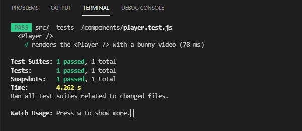
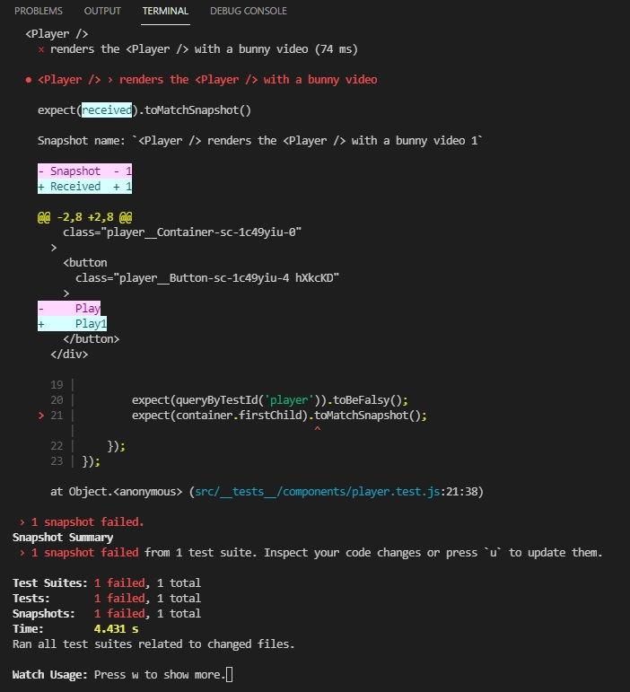

## Netflix 클론 사이트 만들기(ver.2021/06/18)

[테스트가 성공했을때 화면]
</img>

[스냅샷 해둔 코드와 달라졌을경우의 화면]
</img>

* 오늘은 완성된 Netflix 앱에서 각각의 unit 테스트를 진행해봤습니다.
* 가장먼저해본 컴포넌트는 Player 입니다.
* 테스트해볼내용은
-Player의 불리언 기본값이 false로 설정되어있는지
-Play 버튼을 클릭했을시 Player의 불리언 값이 false에서 true가되는지
* React에서 이렇게 unit test를 진행하는 도구가 zest라고 있습니다.
* unit test를 위해선 먼저 src 하위폴더로 이름을 __tests__라고 만들고 이 폴더안에 테스트할 컴포넌트의 파일명에 test를 추가 해줍니다. 예를들어 player.test.js
이런식으로 만들고 그안에 테스트할 코드들을 작성 합니다.

[src/__tests__/components/player.test.js]
```javascript
import React from 'react';
// 먼저 '@testing-library/react' 에서 render와 fireEvent함수를 import 합니다.
// render함수내부에는 테스트할 컴포넌트를 넣을것이고 fireEvent는 요소를가져와 click과같은 이벤트를 실행시켜줍니다.
import { render, fireEvent } from '@testing-library/react';
// 테스트할 컴포넌트도 import 합니다.
import Player from '../../components/player/index';

// describe와 it의 첫번째인자로 문자열을 넣는데 이부분들은 TERMINAL창에서 npm test실행후 결과창에 
  <Player />
    √ renders the <Player /> with a bunny video (70 ms)
// 이런식으로 보여지게됩니다.

describe('<Player />', () => {
    it('renders the <Player /> with a bunny video', () => {
        // render 함수내부에 테스트할 컴포넌트를 넣어주고 컴포넌트를 테스트하는데 필요한 함수들을 가져 옵니다.
        const { container, getByText, queryByTestId } = render(
            <Player>
                <Player.Button />
                <Player.Video src="/videos/bunny.mp4" />
            </Player>
        );

        // 여기서부터 테스트 내용이 들어 갑니다.
        // expect(기대하는 대상).toBeFalsy(대상의 값이 falsy한 값인지)

        expect(queryByTestId('player')).toBeFalsy();
        // queryByTestId 함수는 컴포넌트에 data-testid="player" 속성이 들어있는 요소를 가져옵니다.
        // 현재 player라는 testid를 설정해논 컴포넌트는 동영상영역을 담당하고있는 <Overlay data-testid="player"> 입니다.
        // Play버튼을 클릭해야 영상영역이 true가 되어 보여지기때문에 현재 기본값은 false라 이 테스트코드는 PASS를 하게 됩니다.
        fireEvent.click(getByText('Play'));
        // getByText를 통해 Play라는 문자열을 가지고있는 컴포넌트 요소를 가져 옵니다.
        // 그리고 fireEvent를 통해 click이벤트를 통해 Play버튼이 클릭되어집니다.
        // Play버튼을 클릭하면 영상영역의 값이 true가 됩니다.

        expect(queryByTestId('player')).toBeTruthy();
        // 위에서 버튼을 클릭하도록 이벤트를 주어 값이 true가 되었으므로 toBeTruthy코드는 PASS가 됩니다.
        fireEvent.click(queryByTestId('close'));
        // 동일하게 close라는 data-testid="close" 속성이 들어있는 요소를 가져와 click하면 영상영역의 값은 다시 false가 됩니다.

        expect(queryByTestId('player')).toBeFalsy();
        // toMatchSnapshot 함수는 테스트가 PASS된 코드들을 별도 파일로 저장해놓은뒤 이후에 어떠한 오류가있을때 이전에 찍어둔 스냅샷과 비교하여 무엇이 달라졌는지
        // 터미널에 보여줍니다.
        expect(container.firstChild).toMatchSnapshot();
    });
});
```

[src/components/player/index.js]
```javascript
import React, { useState, useContext, createContext } from 'react';
import ReactDOM from 'react-dom';
import { Container, Button, Overlay, Inner, Close } from './styles/player';

export const PlayerContext = createContext();

export default function Player({ children, ...restProps }) {
    const [showPlayer, setShowPlayer] = useState(false);

    return (
        <PlayerContext.Provider value={{ showPlayer, setShowPlayer }}>
            <Container {...restProps}>{children}</Container>
        </PlayerContext.Provider>
    )
}

Player.Video = function PlayerVideo({ src, ...restProps }) {
    const { showPlayer, setShowPlayer } = useContext(PlayerContext);

    return showPlayer ? ReactDOM.createPortal(
        {/* 테스트를 위해 data-testid를 설정 */}
        <Overlay data-testid="player">
            <Inner>
                <video id="netflix-player" controls>
                    <source src={src} type="video/mp4" />
                </video>
                <Close onClick={() => setShowPlayer(false)} data-testid="close">
                    
                </Close>
            </Inner>
        </Overlay>,
        document.body
    ) : null;
}

Player.Button = function PlayerButton({ ...restProps }) {
    const { showPlayer, setShowPlayer } = useContext(PlayerContext);

    return (
        <Button onClick={() => setShowPlayer(!showPlayer)}>
            Play
        </Button>
    )
}
```