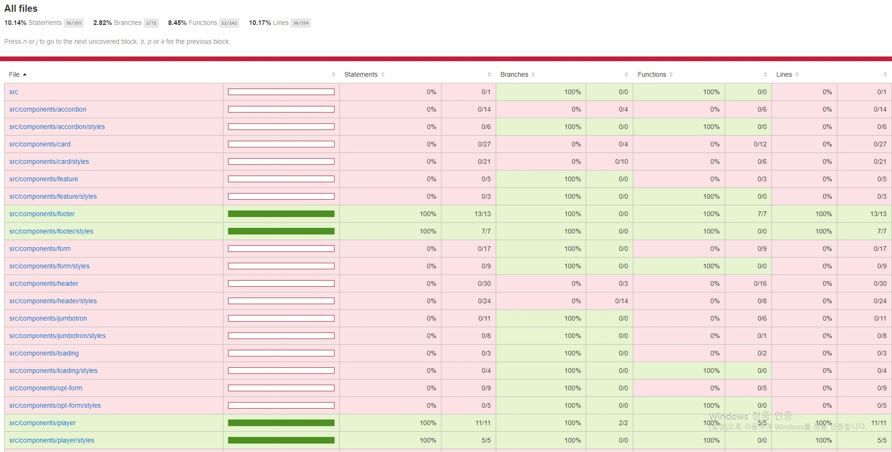

## Netflix 클론 사이트 만들기(ver.2021/06/19)

[code coverage를 이용한 unit test 진행상황]
</img>

* 오늘은 code coverage를 사용하여 netflix앱의 각요소를 테스트하여 검증했습니다.
* 오늘은 Footer 컴포넌트를 테스트 했습니다.
*  Footer에서 테스트할 요소는 아래와같고 이것들이 정상적으로 작동(true)하는지에대한 검증입니다.
-제목(Questions? Contact us.)
-링크(5개정도)

[src/__tests__/components/footer.test.js]
```javascript
import React from 'react';
import { render } from '@testing-library/react';
import Footer from '../../components/footer/index';

describe('<Footer />', () => {
    it('renders the <Footer /> with populated data', () => {
        const { container, getByText} = render(
            <Footer>
                <Footer.Title>Questions? Contact us.</Footer.Title>
                <Footer.Break />
                <Footer.Row>
                    <Footer.Column>
                        <Footer.Link href="#">FAQ</Footer.Link>
                        <Footer.Link href="#">Investor Relations</Footer.Link>
                        <Footer.Link href="#">Ways to Watch</Footer.Link>
                        <Footer.Link href="#">Coporate Information</Footer.Link>
                        <Footer.Link href="#">Netflix Originals</Footer.Link>
                    </Footer.Column>
                    <Footer.Column>
                        <Footer.Link href="#">Help Centre</Footer.Link>
                        <Footer.Link href="#">Jobs</Footer.Link>
                        <Footer.Link href="#">Terms of Use</Footer.Link>
                        <Footer.Link href="#">Contact Us</Footer.Link>
                    </Footer.Column>
                    <Footer.Column>
                        <Footer.Link href="#">Account</Footer.Link>
                        <Footer.Link href="#">Redeem Gift Cards</Footer.Link>
                        <Footer.Link href="#">Privacy</Footer.Link>
                        <Footer.Link href="#">Speed Test</Footer.Link>
                    </Footer.Column>
                    <Footer.Column>
                        <Footer.Link href="#">Media Centre</Footer.Link>
                        <Footer.Link href="#">Buy Gift Cards</Footer.Link>
                        <Footer.Link href="#">Cookie Preferences</Footer.Link>
                        <Footer.Link href="#">Legal Notices</Footer.Link>
                    </Footer.Column>
                </Footer.Row>
                <Footer.Break />
                <Footer.Text>Netflix United Kingdom</Footer.Text>
            </Footer>
        );

        expect(getByText('Questions? Contact us.')).toBeTruthy();
        expect(getByText('FAQ')).toBeTruthy();
        expect(getByText('Investor Relations')).toBeTruthy();
        expect(getByText('Ways to Watch')).toBeTruthy();
        expect(getByText('Coporate Information')).toBeTruthy();
        expect(getByText('Netflix Originals')).toBeTruthy();
        expect(container.firstChild).toMatchSnapshot();
    });
});
```