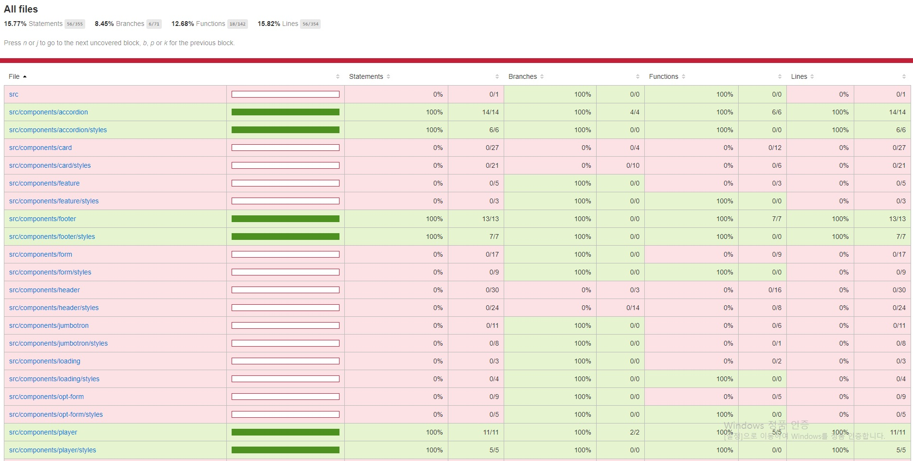

## Netflix 클론 사이트 만들기(ver.2021/06/20)

[code coverage를 이용한 unit test 진행상황]
</img>

* 오늘은 Accordion 컴포넌트를 테스트 했습니다.
*  Footer에서 테스트할 요소는 아래와같고 이것들이 정상적으로 작동(true)하는지에대한 검증입니다.
-Faqs 영역의 Title과 각 Item들의 Header 제목들이 Truthy한지(Header제목들은 json파일을 import하고 map을 사용했음.)
-Header를 click했을시 body의 text가 보여지고(true) 감춰지는지(false)

[src/__tests__/components/accordion.test.js]
```javascript
import React from 'react';
import { render, fireEvent } from '@testing-library/react';
import faqsData from '../../fixtures/faqs.json';
import Accordion from '../../components/accordion/index';

describe('<Accordion />', () => {
    it('renders the <Accordion /> with populated data', () => {
        const { container, getByText } = render(
            <Accordion>
                <Accordion.Title>Frequently Asked Questions</Accordion.Title>
                {faqsData.map((item) => (
                    <Accordion.Item key={item.id}>
                        <Accordion.Header>{item.header}</Accordion.Header>
                        <Accordion.Body>{item.body}</Accordion.Body>
                    </Accordion.Item>
                ))}
            </Accordion>
        );
        // json파일에서 map을사용하여 정상적으로 truthy하게 렌더링 되는지에대한 검증
        expect(getByText('Frequently Asked Questions')).toBeTruthy();
        expect(getByText('What is Netflix?')).toBeTruthy();
        expect(getByText('How much does Netflix cost?')).toBeTruthy();
        expect(getByText('Where can I watch?')).toBeTruthy();
        expect(getByText('How do I cancel?')).toBeTruthy();
        expect(getByText('What can I watch on Netflix?')).toBeTruthy();
        expect(container.firstChild).toMatchSnapshot();
    });

    it('opens and closes the <Accordion /> component', () => {
        const { container, queryByText } = render(
            <Accordion>
                <Accordion.Title>Frequently Asked Questions</Accordion.Title>
                {faqsData.map((item) => (
                    <Accordion.Item key={item.id}>
                        <Accordion.Header>{item.header}</Accordion.Header>
                        <Accordion.Body>{item.body}</Accordion.Body>
                    </Accordion.Item>
                ))}
            </Accordion>
        );

        const whatIsNetflixBodyText = 
        "Netflix is a streaming service that offers a wide variety of award-winning TV programmes, films, anime, documentaries and more – on thousands of internet-connected devices. You can watch as much as you want, whenever you want, without a single advert – all for one low monthly price. There's always something new to discover, and new TV programmes and films are added every week!";
        
        // 앞서 Accordion의 index.js파일에서 Accordion.Header 컴포넌트 안에 toggleShow의 state 초기값을 false로 지정해놨음.
        // 'What is Netflix?'라는 Header컴포넌트를 onClick하면 toggleShow의 값은 true로 바뀜
        // toggleShow의값이 true일때 Accordion.Body가 활성화되고 toggleShow의값이 false이면 Accordion.Body는 null상태가됨.
        
        // 아래과정은 평소에 body는 false여야하고 header를 click했을시 true가되는지에대한 검증
        expect(queryByText(whatIsNetflixBodyText)).toBeFalsy();
        fireEvent.click(queryByText('What is Netflix?'));
        expect(queryByText(whatIsNetflixBodyText)).toBeTruthy();

        fireEvent.click(queryByText('What is Netflix?'));
        expect(queryByText(whatIsNetflixBodyText)).toBeFalsy();
        expect(container.firstChild).toMatchSnapshot();
    });
});
```