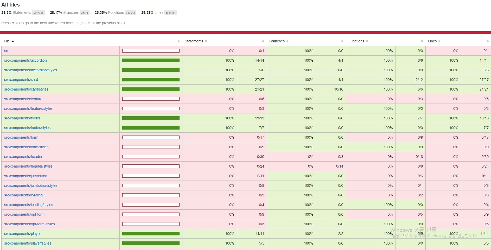

## Netflix 클론 사이트 만들기(ver.2021/06/22)

[code coverage를 이용한 unit test 진행상황]
</img>

* 오늘은 Card 컴포넌트를 테스트 했습니다.
* Card에서 테스트할 요소는 아래와같고 이것들이 정상적으로 작동(true)하는지에대한 검증입니다.
-json파일에서 가져온 컨텐츠 데이터들이 정상적으로 truthy하게 작동여부
-각 컨텐츠(Item)를 클릭했을시 Feature가 true가되면서 내부 요소들이 truthy하게 작동여부

[src/__tests__/components/card.test.js]
```javascript
import React from 'react';
import { render, fireEvent } from '@testing-library/react';
import Card from '../../components/card/index';
import Player from '../../components/player/index';
// <Card.Group> 컴포넌트가 잘 작동하는지 체크하기위해서 'series' 문자열을담은 변수와 컨텐츠 데이터를담은 변수를 만들었습니다.
const category = 'series';

const slideRows = [
    {
        title: "Documentaries",
        data: [
            {
                id: "4f8b816f-7784-446d-900f-1780ad55c81a",
                maturity: "18",
                slug: "tiger-king",
                title: "Tiger King",
                genre: "documentaries",
                description: "Tiger King description",
                docId: "LS2Ysn2RsDUFZegkAvbR"
            }
        ]
    },
    {
        title: "Feel Good",
        data: [
            {
                maturity: "11",
                title: "Juno",
                description: "Juno description",
                slug: "juno",
                id: "55117438-a1f1-4840-aca0-ca1eba10c199",
                genre: "feel-good",
                docId: "QemeXfLYh0GdsdQkGph4"
            }
        ]
    }
];

describe('<Card />', () => {
    it('renders the <Card /> with populated data', () => {
        const { container, getByText } = render (
            <Card.Group>
                {slideRows.map((slideItem) => (
                    <Card key={`${category}-${slideItem.title.toLowerCase()}`}>
                        <Card.Title>{slideItem.title}</Card.Title>
                        <Card.Entities>
                            {slideItem.data.map((item) => (
                                <Card.Item key={item.docId} item={item}>
                                    <Card.Image 
                                        src={`/images/${category}/${item.genre}/${item.slug}/small.jpg`}
                                    />
                                    <Card.Meta>
                                        <Card.SubTitle>{item.title}</Card.SubTitle>
                                        <Card.Text>{item.description}</Card.Text>
                                    </Card.Meta>
                                </Card.Item>
                            ))}
                        </Card.Entities>
                        <Card.Feature category={category}>
                            <Player>
                                <Player.Button />
                                <Player.Video src="/videos/bunny.mp4" />
                            </Player>
                        </Card.Feature>
                    </Card>
                ))}
            </Card.Group>
        );

        // 2개의 변수를 만들고 컴포넌트를 가져왔을때 각요소들이 정상적으로 truthy하게 작동하는지 체크하는 과정 입니다.
        expect(getByText('Documentaries')).toBeTruthy();
        expect(getByText('Tiger King')).toBeTruthy();
        expect(getByText('Tiger King description')).toBeTruthy();

        expect(getByText('Feel Good')).toBeTruthy();
        expect(getByText('Juno')).toBeTruthy();
        expect(getByText('Juno description')).toBeTruthy();
        expect(container.firstChild).toMatchSnapshot();
    });

    it('renders the <Card /> with toggles the card feature', () => {
        const { container, queryByText, getByAltText, getByTestId } = render (
            <Card.Group>
                {slideRows.map((slideItem) => (
                    <Card key={`${category}-${slideItem.title.toLowerCase()}`}>
                        <Card.Title>{slideItem.title}</Card.Title>
                        <Card.Entities>
                            {slideItem.data.map((item) => (
                                <Card.Item key={item.docId} item={item} data-testid={`${item.slug}-item-feature`}>
                                    <Card.Image 
                                        src={`/images/${category}/${item.genre}/${item.slug}/small.jpg`}
                                    />
                                    <Card.Meta>
                                        <Card.SubTitle>{item.title}</Card.SubTitle>
                                        <Card.Text>{item.description}</Card.Text>
                                    </Card.Meta>
                                </Card.Item>
                            ))}
                        </Card.Entities>
                        <Card.Feature category={category}>
                            <Player>
                                <Player.Button />
                                <Player.Video src="/videos/bunny.mp4" />
                            </Player>
                        </Card.Feature>
                    </Card>
                ))}
            </Card.Group>
        );

        // 컨텐츠를 클릭했을시 컨텐츠 내부에숨겨져있던 Feature영역이 제대로 truthy하게 작동하는지 체크하는 과정 입니다.
        expect(queryByText('18')).toBeFalsy();
        fireEvent.click(getByTestId('tiger-king-item-feature'));
        expect(queryByText('18')).toBeTruthy();

        fireEvent.click(getByAltText('Close'));
        expect(queryByText('18')).toBeFalsy();

        expect(queryByText('PG')).toBeFalsy();
        fireEvent.click(getByTestId('juno-item-feature'));
        expect(queryByText('PG')).toBeTruthy();

        fireEvent.click(getByAltText('Close'));
        expect(queryByText('PG')).toBeFalsy();
        expect(container.firstChild).toMatchSnapshot();
    });
});
```