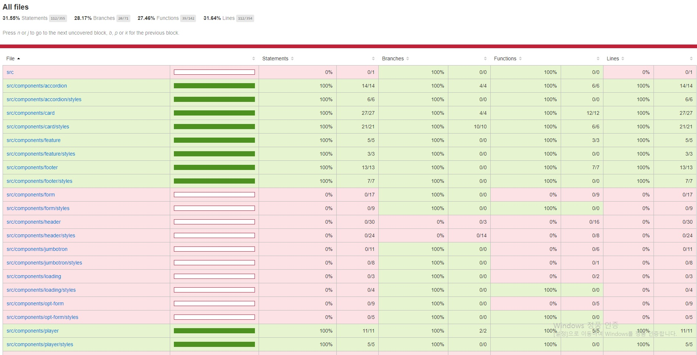

## Netflix 클론 사이트 만들기(ver.2021/06/24)

[code coverage를 이용한 unit test 진행상황]
</img>

* 오늘은 home의 page header 상단에 위치한 Feature 컴포넌트를 테스트 했습니다.
* Feature에서 테스트할 요소는 아래와같고 이것들이 정상적으로 작동(true)하는지에대한 검증입니다.
-Feature의 메인 제목과 서브 제목이 truthy하게 렌더링되는지에대한여부

[src/__tests__/components/feature.test.js]
```javascript
import React from 'react';
import { render } from '@testing-library/react';
import Feature from '../../components/feature/index';

describe('<Feature />', () => {
    it('renders the <Feature /> with populated data', () => {
        const { container, getByText } = render(
            <Feature>
                <Feature.Title>
                    Unlimited films, TV programmes and more.
                </Feature.Title>
                <Feature.SubTitle>
                    Watch anywhere. Cancel at any time.
                </Feature.SubTitle>
            </Feature>
        );

        expect(getByText('Unlimited films, TV programmes and more.')).toBeTruthy();
        expect(getByText('Watch anywhere. Cancel at any time.')).toBeTruthy();
        expect(container.firstChild).toMatchSnapshot();
    });
});
```