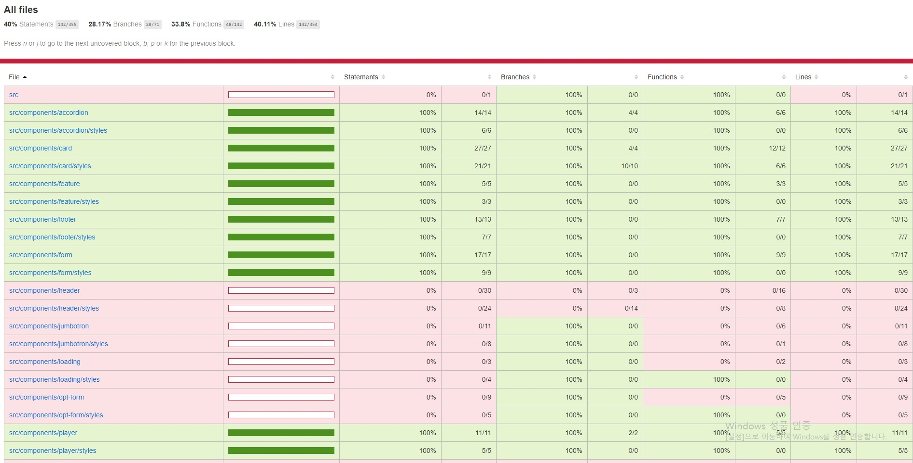

## Netflix 클론 사이트 만들기(ver.2021/06/25)

[code coverage를 이용한 unit test 진행상황]
</img>

* 오늘은 signin 페이지의 form 컴포넌트를 테스트 했습니다.
* form에서 테스트할 요소는 아래와같고 이것들이 정상적으로 작동(true)하는지에대한 검증입니다.
-getByText, getByPlaceholderText를 이용하여 엘리먼트를 찾은 후 정상적으로 truthy하게 렌더링되는지여부 

[src/__tests__/components/form.test.js]
```javascript
import React from 'react';
import { render } from '@testing-library/react';
import Form from '../../components/form/index';
import * as ROUTES from '../../constants/routes';

jest.mock('react-router-dom');

describe('<Form />', () => {
    it('renders the <Form /> with populated data', () => {
        const { container, getByText, getByPlaceholderText } = render(
            <Form>
                <Form.Title>Sign In Now</Form.Title>
                <Form.Base>
                    <Form.Input placeholder="Email address" onChange={() => {}} />
                    <Form.Input
                        placeholder="Password"
                        type="password"
                        onChange={() => {}}
                    />
                    <Form.Submit type="submit" disabled>
                        Sign In
                    </Form.Submit>
                    <Form.Text>
                        New to Netflix? <Form.Link to="/signup">Sign up now.</Form.Link>
                    </Form.Text>
                    <Form.TextSmall>
                        This page is protected by Google reCAPTCHA to ensure you're not a bot. Learn more.
                    </Form.TextSmall>
                </Form.Base>
            </Form>
        );

        expect(getByText("This page is protected by Google reCAPTCHA to ensure you're not a bot. Learn more.")).toBeTruthy();
        expect(getByText('Sign In Now')).toBeTruthy();
        expect(getByText('Sign In')).toBeTruthy();
        expect(getByText('Sign In').disabled).toBeTruthy();
        expect(getByPlaceholderText('Email address')).toBeTruthy();
        expect(getByPlaceholderText('Password')).toBeTruthy();
        expect(container.firstChild).toMatchSnapshot();
    });

    it('renders the <Form /> with an error', () => {
        const { container, getByText } = render(
          <Form>
            <Form.Error>Your email address is already being used</Form.Error>
            <Form.Submit type="submit">Sign In</Form.Submit>
          </Form>
        );
    
        expect(getByText('Your email address is already being used')).toBeTruthy();
        expect(getByText('Sign In').disabled).toBeFalsy();
        expect(container.firstChild).toMatchSnapshot();
    });
});
```