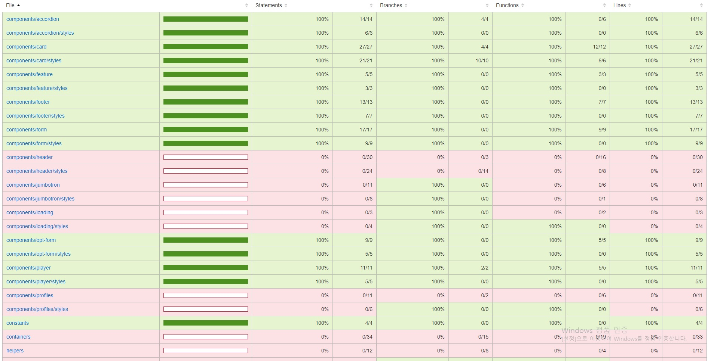

## Netflix 클론 사이트 만들기(ver.2021/06/26)

[code coverage를 이용한 unit test 진행상황]
</img>

* 오늘은 home 페이지의 opt-form 컴포넌트를 테스트 했습니다.
* opt-form에서 테스트할 요소는 아래와같고 이것들이 정상적으로 작동(true)하는지에대한 검증입니다.
-getByText, getByPlaceholderText를 이용하여 엘리먼트를 찾은 후 정상적으로 truthy하게 렌더링되는지여부 

[src/__tests__/components/opt-form.test.js]
```javascript
import React from 'react';
import { render } from '@testing-library/react';
import OptForm  from '../../components/opt-form/index';

describe('<OptForm />', () => {
    it('renders the <OptForm /> with populated data', () => {
        const { container, getByText, getByPlaceholderText } = render(
            <OptForm>
                <OptForm.Input placeholder="Email address" />
                <OptForm.Button>Try it now</OptForm.Button>
                <OptForm.Break />
                <OptForm.Text>
                    Ready to watch? Enter your email to create or restart your membership
                </OptForm.Text>
            </OptForm>
        );

        expect(getByText('Try it now')).toBeTruthy();
        expect(getByText('Ready to watch? Enter your email to create or restart your membership')).toBeTruthy();
        expect(getByPlaceholderText('Email address')).toBeTruthy();
        expect(container.firstChild).toMatchSnapshot();
    });
});
```