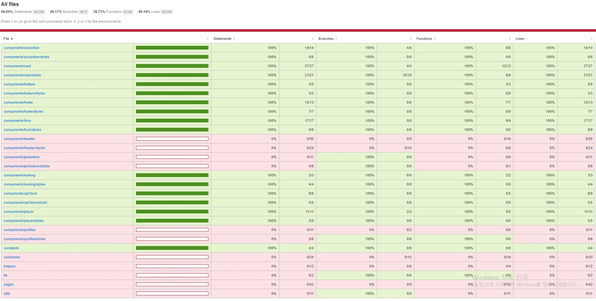

## Netflix 클론 사이트 만들기(ver.2021/06/27)

[code coverage를 이용한 unit test 진행상황]
</img>

* 오늘은 browse 페이지의 loading 컴포넌트를 테스트 했습니다.
* loading에서 테스트할 요소는 아래와같고 이것들이 정상적으로 작동(true)하는지에대한 검증입니다.
-getByTestId를 이용하여 해당 엘리먼트를 찾은 후 정상적으로 truthy하게 렌더링되는지여부 

[src/__tests__/components/loading.test.js]
```javascript
import React from 'react';
import { render } from '@testing-library/react';
import Loading from '../../components/loading/index';

describe('<Loading />', () => {
    it('renders the <Loading /> component', () => {
        const { container, getByTestId } = render(
            <Loading src="/images/jiseong.png" data-testid="loading" />
        );

        expect(getByTestId('loading')).toBeTruthy();
        expect(getByTestId('loading-picture')).toBeTruthy();
        expect(container.firstChild).toMatchSnapshot();
    });

    it('renders the <Loading.ReleaseBody />', () => {
        const { container } = render(<Loading.ReleaseBody />);
        
        expect(container.firstChild).toMatchSnapshot();
    });
});
```