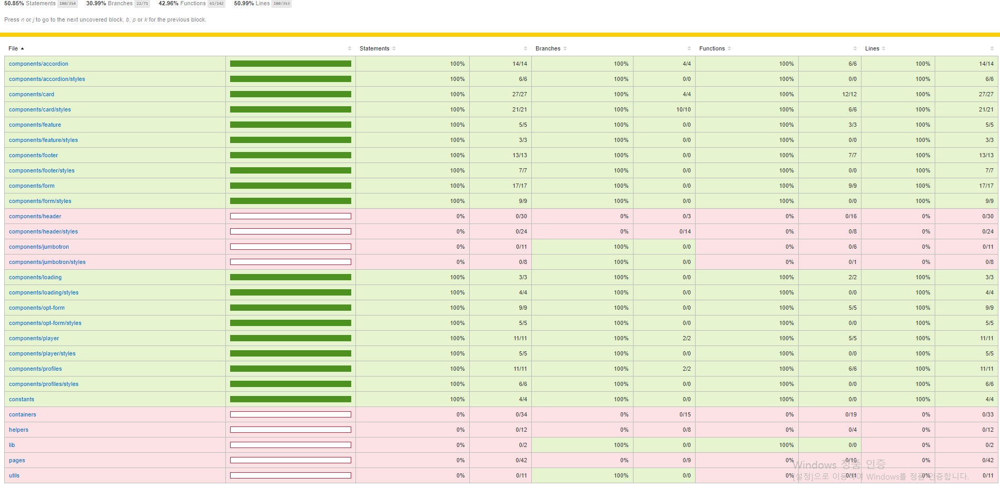

## Netflix 클론 사이트 만들기(ver.2021/06/28)

[code coverage를 이용한 unit test 진행상황]
</img>

* 오늘은 loading화면 이후 어떤 프로필을 선택하는지에대한 profiles 컴포넌트를 테스트 했습니다.
* profiles에서 테스트할 요소는 아래와같고 이것들이 정상적으로 작동(true)하는지에대한 검증입니다.
-getByText, getByTestId를 이용하여 해당 엘리먼트를 찾은 후 정상적으로 truthy하게 렌더링되는지여부 

[src/__tests__/components/profiles.test.js]
```javascript
import React from 'react';
import { render } from '@testing-library/react';
import Profiles from '../../components/profiles/index';

describe('<Profiles />', () => {
    it('renders the <Profiles /> with populated data', () => {
        const { container, getByText, getByTestId } = render(
            <Profiles>
                <Profiles.Title>Who's watching?</Profiles.Title>
                <Profiles.List>
                    <Profiles.User onClick={() => {}}>
                        <Profiles.Picture src='/images/jiseong.png' data-testid="profile-picture" />
                        <Profiles.Name>Jiseong Noh</Profiles.Name>
                    </Profiles.User>
                </Profiles.List>
            </Profiles>
        );

        expect(getByText("Who's watching?")).toBeTruthy();
        expect(getByTestId('profile-picture')).toBeTruthy();
        expect(getByText('Jiseong Noh')).toBeTruthy();
        expect(container.firstChild).toMatchSnapshot();
    });

    it('renders the <Profiles /> with populated data but misc profile image', () => {
        const { container, getByText, getByTestId } = render(
            <Profiles>
                <Profiles.Title>Who's watching?</Profiles.Title>
                <Profiles.List>
                    <Profiles.User onClick={() => {}}>
                        <Profiles.Picture data-testid="profile-picture-misc" />
                        <Profiles.Name>Jiseong Noh</Profiles.Name>
                    </Profiles.User>
                </Profiles.List>
            </Profiles>
        );

        expect(getByText("Who's watching?")).toBeTruthy();
        expect(getByTestId('profile-picture-misc')).toBeTruthy();
        expect(getByText('Jiseong Noh')).toBeTruthy();
        expect(container.firstChild).toMatchSnapshot();
    });
});
```