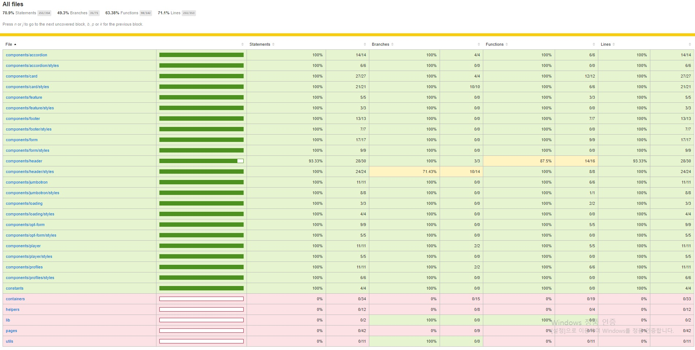

## Netflix 클론 사이트 만들기(ver.2021/06/30)

[code coverage를 이용한 unit test 진행상황]
</img>

[fireEvent를 통한 검증이되지않은 오류]
* SearchInput 의 onChange속성과 SearchIcon의 onClick속성 의 fireEvent를 통한 이벤트 동작검증이 되지않음
</img>

* 오늘은 browse 컨테이너에서 header영역의 요소들이 정상적으로 작동하는지 테스트 했습니다.
* header에서 테스트할 요소는 아래와같고 이것들이 정상적으로 작동(true)하는지에대한 검증입니다.
-getByText, getByAltText, getByTestId, queryByTestId를 이용하여 해당 엘리먼트를 찾은 후 정상적으로 truthy하게 렌더링되는지여부 

[src/__tests__/components/header.test.js]
```javascript
import React from 'react';
import { fireEvent, render } from '@testing-library/react';
import Header from '../../components/header/index';

jest.mock('react-router-dom');

describe('<Header />', () => {
    // 배경이미지가 활성화일 때의 테스트
    it('renders the basic <Header /> with a background', () => {
        const { container, getByText, getByTestId } = render(
            <Header>
                <Header.Frame>
                    <Header.Logo src="/logo.svg" alt="Netflix" />
                    <Header.TextLink active="true">Hello I am a link!</Header.TextLink>
                </Header.Frame>
            </Header>
        );

        expect(getByText('Hello I am a link!')).toBeTruthy();
        expect(getByTestId('header-bg')).toBeTruthy();
        expect(container.firstChild).toMatchSnapshot();
    });

    // 배경이미지가 비활성화일 때의 테스트
    it('renders the basic <Header /> without a background', () => {
        const { container, getByText, queryByTestId } = render(
            <Header bg={false}>
                <Header.Frame>
                    <Header.Logo src="/logo.svg" alt="Netflix" />
                    <Header.ButtonLink>Sign In</Header.ButtonLink>
                    <Header.TextLink active="false">Hello I am a link!</Header.TextLink>
                </Header.Frame>
            </Header>
        );

        expect(getByText('Hello I am a link!')).toBeTruthy();
        expect(queryByTestId('header-bg')).toBeFalsy();
        expect(container.firstChild).toMatchSnapshot();
    });

    // 배경이미지와 Header아래 모든요소를 체크하는 테스트
    it('renders the full <Header /> with a background', () => {
        const { container, getByText, getByTestId } = render(
            <Header src="joker1" dontShowOnSmallViewPort>
                <Header.Frame>
                    <Header.Group>
                        <Header.Logo src="/images/logo.svg" alt="Netflix" />
                        <Header.TextLink
                            active={false}
                            onClick={() => {}}
                        >
                            Series
                        </Header.TextLink>
                        <Header.TextLink
                            active
                            onClick={() => {}}
                        >
                            Films
                        </Header.TextLink>
                    </Header.Group>
                    <Header.Group>
                        <Header.Search searchTerm="Joker" setSearchTerm={() => {}} />
                        <Header.Profile>
                            <Header.Picture src="/images/jiseong.png" />
                            <Header.Dropdown>
                                <Header.Group>
                                    <Header.Picture src="/images/jiseong.png" />
                                    <Header.TextLink>Jiseong Noh</Header.TextLink>
                                </Header.Group>
                                <Header.Group>
                                    <Header.TextLink onClick={() => {}}>Sign out</Header.TextLink>
                                </Header.Group>
                            </Header.Dropdown>
                        </Header.Profile>
                    </Header.Group>
                </Header.Frame>
                <Header.Feature>
                    <Header.FeatureCallOut>Watch Joker Now</Header.FeatureCallOut>
                    <Header.Text>
                        Forever alone in a crowd...
                    </Header.Text>
                    <Header.PlayButton>Play</Header.PlayButton>
                </Header.Feature>
            </Header>
        );

        expect(getByTestId('search-input')).toBeTruthy();
        expect(getByTestId('search-input').value).toBe('Joker');
        // input태그에 target.value를 바꿔 <SearchInput /> 의 onChange속성이 작동하는지 체크
        fireEvent.change(getByTestId('search-input'), { target: { value: 'Simpsons' } });
        // <SearchIcon />의 onClick속성이 작동하는지 체크
        fireEvent.click(getByTestId('search-click'));

        expect(getByText('Series')).toBeTruthy();
        expect(getByText('Films')).toBeTruthy();
        expect(getByText('Jiseong Noh')).toBeTruthy();
        expect(getByText('Watch Joker Now')).toBeTruthy();
        expect(getByText('Sign out')).toBeTruthy();
        expect(getByText('Forever alone in a crowd...')).toBeTruthy();
        expect(getByText('Play')).toBeTruthy();
        expect(container.firstChild).toMatchSnapshot();
    });
});
```