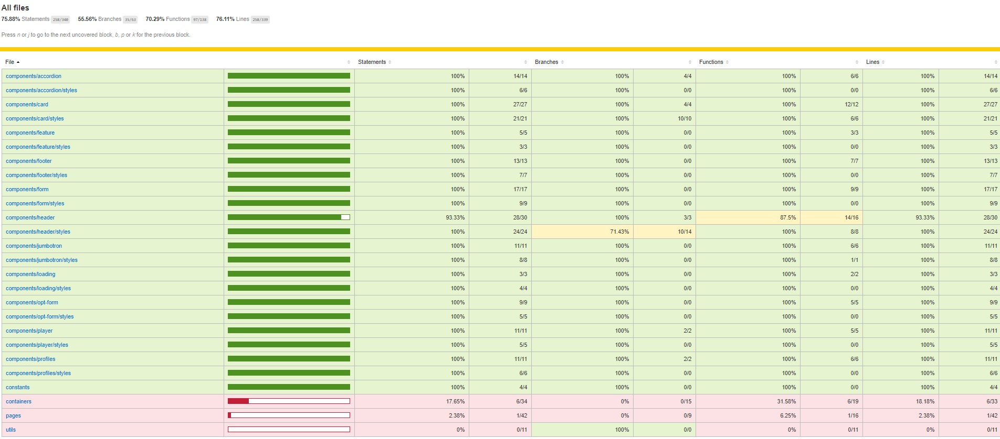
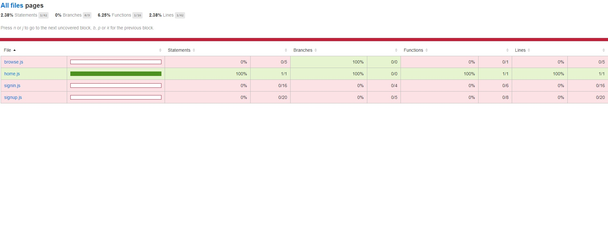

## Netflix 클론 사이트 만들기(ver.2021/07/01)

[code coverage를 이용한 unit test 진행상황]
</img>

</img>


* 오늘은 pages중 home컴포넌트가 정상적으로 작동하는지 테스트 했습니다.
* home에서 테스트할 요소는 아래와같고 이것들이 정상적으로 작동(true)하는지에대한 검증입니다.
-getByText, getAllByText, getAllByPlaceholderText를 이용하여 해당 엘리먼트를 찾은 후 정상적으로 truthy하게 렌더링되는지여부 

[src/__tests__/pages/home.test.js]
```javascript
import React from 'react';
import { render } from '@testing-library/react';
import Home from '../../pages/home';

jest.mock('react-router-dom');

test('renders the homepage', () => {
    const { getByText, getAllByText, getAllByPlaceholderText } = render(<Home />);
    expect(getByText('Unlimited films, TV programmes and more.')).toBeTruthy();
    expect(getByText('Watch anywhere. Cancel at any time.')).toBeTruthy();
    expect(getAllByPlaceholderText('Email address')).toBeTruthy();
    expect(getAllByText('Try it now')).toBeTruthy();
    expect(getAllByText('Ready to watch? Enter your email to create or restart your membership.')).toBeTruthy();
});
```