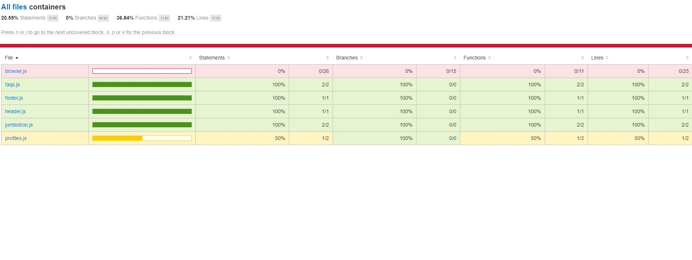
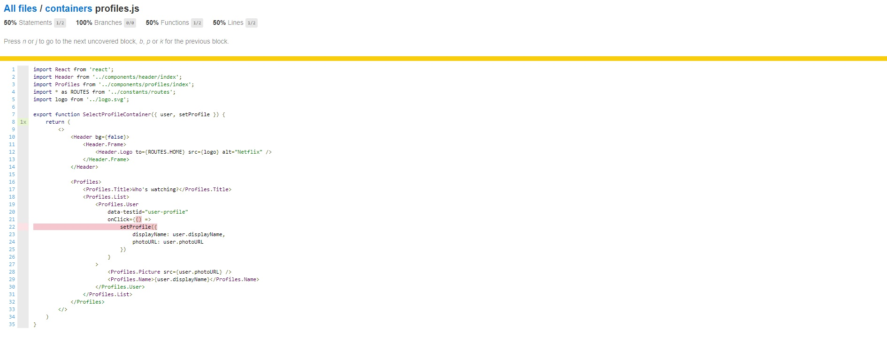
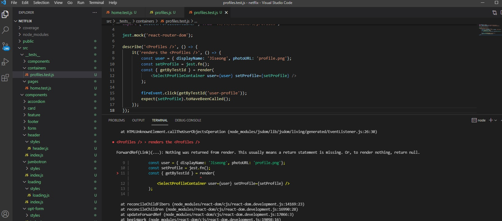

## Netflix 클론 사이트 만들기(ver.2021/07/02)

[code coverage를 이용한 unit test 진행상황]
</img>

</img>

[역시나 SelectProfileContainer내부에 ROUTE와 LINK를 사용한 컴포넌트가 있으면 test시 렌더링 할것이없다는오류가 나온다.]
[렌더링이 안되니 내부에있는 기능들이 제대로 활성화되지않고있다.]
</img>


* 오늘은 containers중 SelectProfileContainer컴포넌트가 정상적으로 작동하는지 테스트 했습니다.
* SelectProfileContainer에서 테스트할 요소는 아래와같고 이것들이 정상적으로 작동(true)하는지에대한 검증입니다.
-getByTestId와 fireEvent를 이용하여 해당 엘리먼트를 찾은 후 이벤트를 주었을때 기대하는값(setProfile)이 호출 되는지에대한 여부

[src/__tests__/containers/profiles.test.js]
```javascript
import React from 'react';
import { render, fireEvent } from '@testing-library/react';
import { SelectProfileContainer } from '../../containers/profiles';

jest.mock('react-router-dom');

describe('<Profiles />', () => {
    it('renders the <Profiles />', () => {
        const user = { displayName: 'Jiseong', photoURL: 'profile.png'};
        const setProfile = jest.fn();
        const { getByTestId } = render(
            <SelectProfileContainer user={user} setProfile={setProfile} />
        );

        fireEvent.click(getByTestId('user-profile'));
        expect(setProfile).toHaveBeenCalled();
    });
});
```