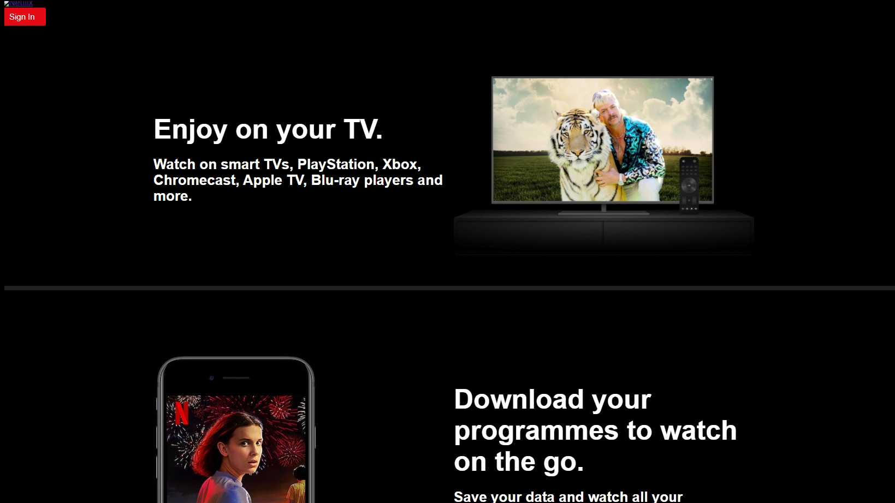

## Netflix 클론 사이트 만들기(ver.2021/05/20)

</img>

* 오늘은 Header영역에 필요한 컴포넌트를 생성하고 button부분에 css를 넣어주었습니다.
* 마찬가지로 header영역이란 부품을 만들어 컨테이너에 포장시켜 home.js에 진열하는 과정 입니다.

[src/components/header/index.js]
```javascript
// header영역의 뼈대가 될 컴포넌트들을 만듭니다.
import React from 'react';
import { Link as ReactRouterLink } from 'react-router-dom';
import { Background, ButtonLink, Container, Logo } from './styles/header';

export default function Header({ bg=true, children, ...restProps }) {
    return bg ? <Background {...restProps}>{children}</Background> : children;
}

Header.Frame = function HeaderFrame({ children, ...restProps }) {
    return <Container {...restProps}>{children}</Container>;
};

Header.ButtonLink = function HeaderButtonLink({ children, ...restProps }) {
    return <ButtonLink {...restProps}>{children}</ButtonLink>;
};

Header.Logo = function HeaderLogo({ to, ...restProps }) {
    return (
        <ReactRouterLink to={to}>
            <Logo {...restProps} />
        </ReactRouterLink>
    );
};
```

[src/components/header/styles/header.js]
```javascript
// header영역의 각 요소들의 스타일 컴포넌트를 만듭니다.
import styled from 'styled-components';
import { Link as ReactRouterLink } from 'react-router-dom';

export const Background = styled.div``;

export const Frame = styled.div``;

export const Container = styled.div``;

export const Logo = styled.img``;

export const ButtonLink = styled(ReactRouterLink)`
    display: block;
    background-color: #e50914;
    width: 84px;
    height: fit-content;
    color: white;
    border: 0;
    font-size: 15px;
    border-radius: 3px;
    padding: 8px 17px;
    cursor: pointer;
    text-decoration: none;
    box-sizing: border-box;

    &:hover {
        background-color: #f40612;
    }
`;
```

[src/containers/header.js]
```javascript
// 그렇게 만든 header영역의 뼈대를 header 컨테이너로 import해오고 적절히 마크업 해줍니다.
import React from 'react';
import Header from '../components/header/index';
import * as ROUTES from '../constants/routes';

export default function HeaderContainer({ children }) {
    return (
        <Header>
            <Header.Frame>
                <Header.Logo to={ROUTES.HOME} alt="Netflix" />
                <Header.ButtonLink to={ROUTES.SIGN_IN}>Sign In</Header.ButtonLink>
            </Header.Frame>
            {children}
        </Header>
    );
}
```

[src/pages/home.js]
```javascript
// 만들어진 header 컨테이너를 home.js로 import 해줍니다.(home.js는 최상위 컴포넌트 app.js에 이미 적용되어있습니다.)
import React from 'react';
import HeaderContainer from '../containers/header';
import JumbotronContainer from '../containers/jumbotron';
import FaqsContainer from '../containers/faqs';
import FooterContainer from '../containers/footer';

export default function Home() {
    return (
        <>
            <HeaderContainer>
                <JumbotronContainer />
                <FaqsContainer />
                <FooterContainer />
            </HeaderContainer>
        </>
    );
}
```